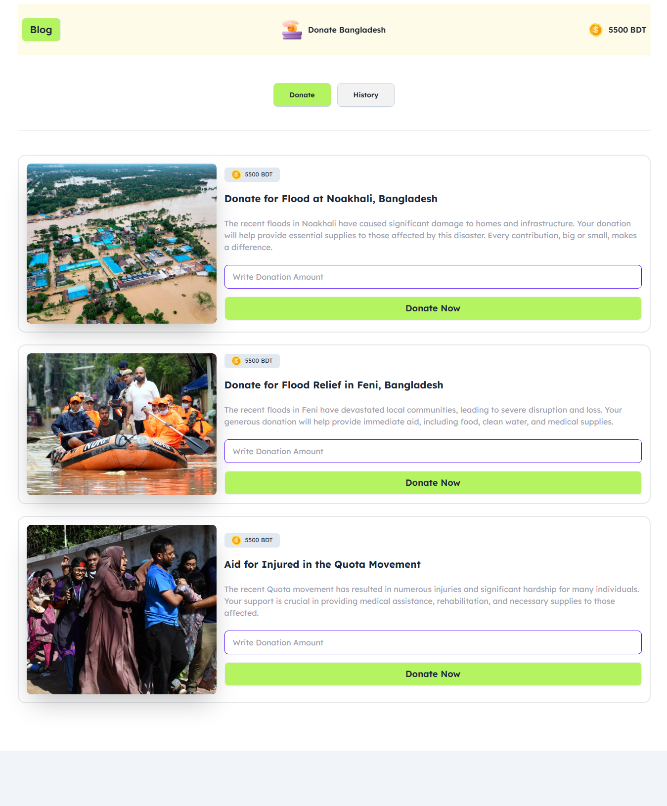

# 🌟 Donate Bangladesh | Interactive Donation Platform

[](https://donatebangladesha05.netlify.app/)


This repository contains my submission for Assignment 5 of the Programming Hero Web Development Course (Batch 10). The project is an interactive donation platform that allows users to contribute to various humanitarian causes in Bangladesh.

## 🌐 Live Preview
🔗 **[https://donatebangladesha05.netlify.app/](https://donatebangladesha05.netlify.app/)**

## 🖼️ Screenshot
A preview of the deployed project:


## 📌 About This Project
"Donate Bangladesh" is an interactive web application that simulates a donation platform for various humanitarian causes in Bangladesh. Users start with a virtual balance and can donate to different causes like flood relief in Noakhali and Feni, or aid for those injured in the Quota Movement. The application tracks donation history and provides a seamless user experience with real-time balance updates.

## 🎯 Key Features
- **Interactive Donation System:** Make donations to multiple causes with real-time balance updates
- **Donation History:** Track all previous donations with timestamps
- **Responsive Design:** Fully functional across all device sizes
- **Modern UI:** Clean interface built with Tailwind CSS and DaisyUI
- **DOM Manipulation:** Dynamic content updates without page reloads
- **Educational Blog:** Informative FAQ section about DOM concepts

## 🛠️ Technologies Used
| Technology | Purpose |
|------------|---------|
| **HTML5** | For semantic content structure |
| **Tailwind CSS** | For utility-first styling approach |
| **DaisyUI** | For pre-designed components and UI elements |
| **JavaScript** | For interactive functionality and DOM manipulation |
| **Git & GitHub** | For version control and code hosting |
| **Netlify** | For continuous deployment and hosting |

## 📂 Project Structure
```
B10-Assignment-5/
├── assets/
│   ├── coin.png
│   ├── faq.png
│   ├── feni.png
│   ├── logo.png
│   ├── noakhali.png
│   ├── quota-protest.png
│   └── site-Screenshot.png
├── JS/
│   ├── script.js
│   └── utility.js
├── blog.html
├── index.html
├── package.json
├── tailwind.config.js
└── README.md
```

## 🚀 How To Get Started
To explore this project on your local machine, follow these steps:

1. **Clone the repository:**
   ```bash
   git clone https://github.com/yourusername/B10-Assignment-5.git
   ```
2. **Navigate to the project directory:**
   ```bash
   cd B10-Assignment-5
   ```
3. **Install dependencies:**
   ```bash
   npm install
   ```
4. **Open `index.html` in your web browser.**

## 💡 Learning Outcomes
- **DOM Manipulation:** Gained practical experience in dynamically updating web content
- **Event Handling:** Implemented event listeners for interactive user experiences
- **Modern CSS Frameworks:** Applied Tailwind CSS and DaisyUI for efficient styling
- **JavaScript Functions:** Created reusable functions for donation processing
- **Responsive Design:** Ensured the application works seamlessly across all devices

## 🙏 Acknowledgements
A special thank you to the entire [Programming Hero](https://web.programming-hero.com/) team and our mentors for their invaluable guidance and support. This assignment has been a fantastic learning experience in applying JavaScript DOM manipulation concepts to create an interactive web application.